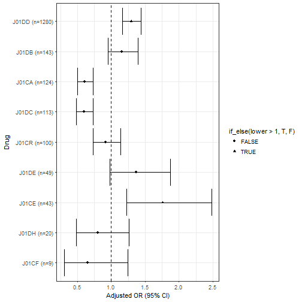
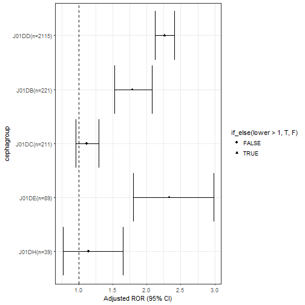
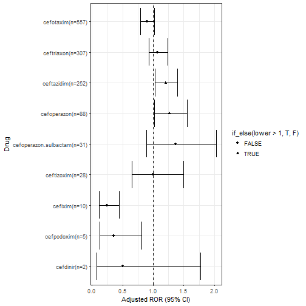
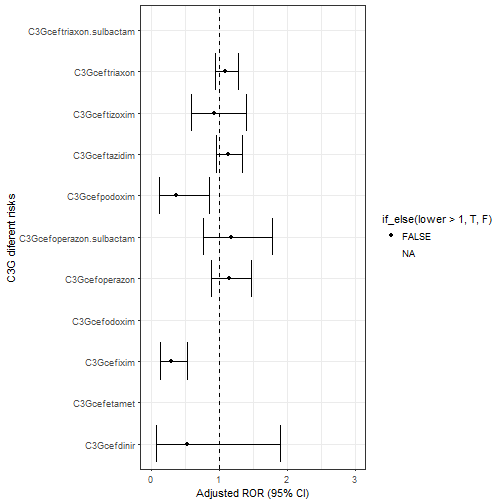

# 1.Kết nối dữ liệu data 2010-2016 - remove duplicate


```r
# drug1016.Edited %>% filter(Group=="AntibacterialSystematic") %>% filter(ATC=="") 
# 0 rows -> OK no drug withou ATC code in antibiotic


betalactam1016=drug1016.Edited %>%mutate(GrPhar=substr(ATC,1,4),
                                         Year=substr(as.character(Year.ID),1,4)) %>%
  filter(Group=="AntibacterialSystematic") %>%
  filter(GrPhar %in% c("J01D","J01C")) %>% unique()

          
          id=betalactam1016$Year.ID
          # #To return ALL MINUS ONE duplicated values:
          # id[duplicated(id)]
          # 
          # #To return ALL duplicated values by specifying fromLast argument:
          # id[duplicated(id) | duplicated(id, fromLast=TRUE)]
          #Yet another way to return ALL duplicated values, using %in% operator:
          id.trung1016= unique(id[id %in% unique(id[duplicated(id)])])
```

## 2.List report combination with betalactamase


```r
# elimination of coprescription 2 suspected betaclam

betalactam1016 %>% filter(Year.ID %in% id.trung1016) %>% View()

id.betalactamse1016=c(  201098,201096,   2010556,  20101100,  20101355,  20101374,  20101399,  20101401,  
                    20101406,  20101438,  20101443,  20101457,  20101492
                   
) %>% as.character() 

betalactam1016 %>% filter(Year.ID %in% id.betalactamse1016)   #  loai do 2 betalactam tren 1 thuoc 
```

```
## # A tibble: 27 x 6
##        ATC            Drug Year.ID                   Group GrPhar  Year
##      <chr>           <chr>   <dbl>                   <chr>  <chr> <chr>
##  1 J01CA01      ampicillin   2e+05 AntibacterialSystematic   J01C  2010
##  2 J01DD01       cefotaxim   2e+05 AntibacterialSystematic   J01D  2010
##  3 J01CG01       sulbactam   2e+05 AntibacterialSystematic   J01C  2010
##  4 J01CA01      ampicillin   2e+05 AntibacterialSystematic   J01C  2010
##  5 J01CG01       sulbactam   2e+05 AntibacterialSystematic   J01C  2010
##  6   J01CR acid clavulanic   2e+06 AntibacterialSystematic   J01C  2010
##  7 J01CA04     amoxicillin   2e+06 AntibacterialSystematic   J01C  2010
##  8   J01CR acid clavulanic   2e+07 AntibacterialSystematic   J01C  2010
##  9 J01CA04     amoxicillin   2e+07 AntibacterialSystematic   J01C  2010
## 10   J01CR acid clavulanic   2e+07 AntibacterialSystematic   J01C  2010
## # ... with 17 more rows
```

```r
id.betalactamse1016[-2] # loai gia tri thu 2 tuong duong bao cao 201096
```

```
##  [1] "201098"   "2010556"  "20101100" "20101355" "20101374" "20101399"
##  [7] "20101401" "20101406" "20101438" "20101443" "20101457" "20101492"
```

```r
betalactam1016=betalactam1016 %>% mutate(
  Drug=replace(Drug,Year.ID=="201098","ampicilin/sulbactam"),
  Drug=replace(Drug,Year.ID=="2010556","amoxicilin/acid clavulanic"), 
  Drug=replace(Drug,Year.ID=="20101100","amoxicilin/acid clavulanic"),
  Drug=replace(Drug,Year.ID=="20101355","amoxicilin/acid clavulanic"),
  
  Drug=replace(Drug,Year.ID=="20101374","amoxicilin/acid clavulanic"),
  Drug=replace(Drug,Year.ID=="20101399","amoxicilin/acid clavulanic"),
  Drug=replace(Drug,Year.ID=="20101401","amoxicilin/acid clavulanic"),
  Drug=replace(Drug,Year.ID=="20101406","amoxicilin/acid clavulanic"),
  Drug=replace(Drug,Year.ID=="20101438","cefoperazon/sulbactam"),
  Drug=replace(Drug,Year.ID=="20101443","amoxicilin/acid clavulanic"),
  Drug=replace(Drug,Year.ID=="20101457","amoxicilin/acid clavulanic"),
  Drug=replace(Drug,Year.ID=="20101492","piperacillin/tazobactam")) %>% 
  
  mutate(Drug=str_replace_all(Drug,"cilin","cillin")) %>%
  
  select(-ATC) %>% unique()

     # betalactam1016 %>% View

id=betalactam1016$Year.ID     
ds.trung.final1016=betalactam1016 %>% filter(Year.ID %in%  id[id %in% unique(id[duplicated(id)])],
                                     !Year.ID %in% id.betalactamse[-2])%>% unique() # 181


betalactam.nodup1016=betalactam1016%>% filter(!Year.ID%in%ds.trung.final$Year.ID) %>% unique()


betalactam.nodup.casenoncase.1016=betalactam.nodup1016 %>%left_join(
  d1016.2 %>% select(Year,Year.ID=mabc,Age,Sex,Case,Mortality)
) %>% 
  mutate( Drug=replace(Drug,Year.ID=="20147153","imipenem/cilastatin")) %>% filter(Case %in% 0:1) %>% 
  mutate(
  Drug=replace(Drug,Drug=="amipicillin/sulbactam","ampicillin/sulbactam"),
   Drug=replace(Drug,Drug=="cefotaxime","cefotaxim"),
  Drug=replace(Drug,Drug=="cefpirome","cefpirom"),
  Drug=replace(Drug,Drug=="ceftriaxone","ceftriaxon"),
  Drug=replace(Drug,Drug=="amoxicillin/clavunanic","amoxicillin/acid clavulanic"),
  
  Drug=replace(Drug,Drug=="benzathin penicillin g","benzathine benzylpenicillin"),
  Drug=replace(Drug,Drug=="penicillin g","benzylpenicillin"),
  Drug=replace(Drug,Drug=="penicillin v","phenoxymethylpenicillin")
  
  	 
  
  
  )%>% left_join(read_excel("Betalactam ATC code update.xlsx") %>% select(Drug,ATC)) %>% 
  mutate(subgroup.betalactam=substr(ATC,1,5))
```


```r
betalactam.nodup.casenoncase.1016 %>% group_by(Drug) %>% tally(sort=T)  %>% unique()
```

```
## # A tibble: 54 x 2
##                           Drug     n
##                          <chr> <int>
##  1                   cefotaxim  3115
##  2                  ceftriaxon  1561
##  3                  ceftazidim  1192
##  4                   cefuroxim   703
##  5                 amoxicillin   701
##  6                 cefoperazon   405
##  7                   cefalexin   371
##  8                  ampicillin   278
##  9 amoxicillin/acid clavulanic   271
## 10        ampicillin/sulbactam   193
## # ... with 44 more rows
```

```r
betalactam.nodup.casenoncase.1016 %>% group_by(GrPhar) %>% tally(sort=T)  %>% unique()
```

```
## # A tibble: 2 x 2
##   GrPhar     n
##    <chr> <int>
## 1   J01D  8892
## 2   J01C  1904
```

```r
betalactam.nodup.casenoncase.1016 %>% group_by(subgroup.betalactam) %>% tally(sort=T)  %>% unique()
```

```
## # A tibble: 11 x 2
##    subgroup.betalactam     n
##                  <chr> <int>
##  1               J01DD  6824
##  2               J01CA  1054
##  3               J01DC   975
##  4               J01DB   735
##  5               J01CR   614
##  6               J01DE   220
##  7               J01CE   160
##  8               J01DH   138
##  9               J01CF    74
## 10               J01CG     1
## 11                J01D     1
```

# 3.Subgroup signals : J01DD and J01CE   


```r
subgroup.betalactam.list=betalactam.nodup.casenoncase.1016%>%group_by(subgroup.betalactam) %>%
  tally(sort=T) %>% filter(subgroup.betalactam!="J01D") #%>% View ()


for (i in 1:nrow(subgroup.betalactam.list)){
  temp=betalactam.nodup.casenoncase.1016 %>%   filter(., grepl(subgroup.betalactam.list[i,]$subgroup.betalactam, subgroup.betalactam))
  varname <- paste(subgroup.betalactam.list[i,]$subgroup.betalactam )
  
  betalactam.nodup.casenoncase.1016[[varname]]=with(betalactam.nodup.casenoncase.1016,if_else(Year.ID%in% temp$Year.ID,1,0))
  
}

OR.subgroup.betalactam=NULL

for (i in 1:nrow(subgroup.betalactam.list)){

    formula.i=lapply(subgroup.betalactam.list[i,]$subgroup.betalactam,
                   function(var) formula(paste0('Case~',var),env=globalenv()))
  OR.subgroup.betalactam=rbind(OR.subgroup.betalactam,
     betalactam.nodup.casenoncase.1016 %>% 
    select(Year,Age,Sex,Case,matches(subgroup.betalactam.list[i,]$subgroup.betalactam)) %>% 
    glm(formula=formula.i[[1]],family=binomial(link="logit")) %>% OR95()%>% 
    tibble::rownames_to_column() %>% filter(between(row_number(), 2, n()))  
  )
  
  }

OR.subgroup.betalactam.n=betalactam.nodup.casenoncase.1016 %>% filter(Year.ID %in% subset(betalactam.nodup.casenoncase.1016,Case==1)$Year.ID) %>% group_by(subgroup.betalactam) %>% tally(sort=T) %>% left_join(
  OR.subgroup.betalactam ,  by = c("subgroup.betalactam" = "rowname") 
)


OR.subgroup.betalactam.n %>% print()
```

```
## # A tibble: 9 x 5
##   subgroup.betalactam     n    OR lower upper
##                 <chr> <int> <dbl> <dbl> <dbl>
## 1               J01DD  1280  1.30  1.17  1.44
## 2               J01DB   143  1.16  0.95  1.39
## 3               J01CA   124  0.61  0.50  0.73
## 4               J01DC   113  0.60  0.49  0.73
## 5               J01CR   100  0.92  0.73  1.14
## 6               J01DE    49  1.37  0.98  1.87
## 7               J01CE    43  1.76  1.22  2.48
## 8               J01DH    20  0.80  0.48  1.26
## 9               J01CF     9  0.65  0.30  1.25
```

```r
OR.subgroup.betalactam.n %>% unique() %>% 
  mutate(subgroup.betalactam=paste0(subgroup.betalactam,' (n=',n,")")) %>%
  arrange(n) %>%  mutate(subgroup.betalactam = factor(subgroup.betalactam, subgroup.betalactam)) %>% 
ggplot(  aes(x=subgroup.betalactam, y=OR, ymin=lower, ymax=upper)) +
  geom_errorbar() + 
  geom_point(aes(shape=if_else(lower>1,T,F))) + #,col="blue",shape=5
  geom_hline(yintercept=1, lty=2) +  # add a dotted line at x=1 after flip
  coord_flip() +  # flip coordinates (puts labels on y axis)
  xlab("Drug") + ylab("Adjusted OR (95% CI)") +
  theme_bw()  # use a white background
```


                 

## 3.1.Signal of subgroup.cepha


```r
for (i in 1:length(subgroup.cepha)){
  temp=cepha %>%   filter(., grepl(subgroup.cepha[i], cephagroup))
  varname <- paste(subgroup.cepha[i] )
  
  d1016.3[[varname]]=with(d1016.3,if_else(mabc%in% temp$Year.ID,1,0))

  
}

OR.table.subgroupcepha.1016=NULL

for (i in 1:length(subgroup.cepha)){

    formula.i=lapply(subgroup.cepha[i],
                   function(var) formula(paste0('Case~',var),env=globalenv()))
  OR.table.subgroupcepha.1016=rbind(OR.table.subgroupcepha.1016,
     d1016.3 %>% #filter(ATC!="J01D") %>% 
    select(Year,Age,Sex,Case,matches(subgroup.cepha[i])) %>% 
    glm(formula=formula.i[[1]],family=binomial(link="logit")) %>% OR95()%>% 
    tibble::rownames_to_column() %>% filter(between(row_number(), 2, n()))  
  )
  
}
OR.table.subgroupcepha.1016 %>% print()
```

```
##   rowname  OR lower upper
## 1   J01DD 2.3  2.12   2.4
## 2   J01DB 1.8  1.52   2.1
## 3   J01DC 1.1  0.95   1.3
## 4   J01DH 1.1  0.76   1.6
## 5   J01DE 2.3  1.80   3.0
```

```r
OR.table.subgroupcepha.1016.n=cepha %>% left_join(d1016.3 %>% select(Year.ID=mabc,Case) %>% filter(Case==1))%>% filter(Case==1) %>% group_by(cephagroup) %>% tally() %>% filter(cephagroup!="J01D") %>% 
    left_join(OR.table.subgroupcepha.1016 ,by = c("cephagroup" = "rowname")) 


OR.table.subgroupcepha.1016.n %>% unique() %>% mutate(cephagroup=paste0(cephagroup,'(n=',n,")")) %>% 
  arrange(n) %>%  mutate(cephagroup = factor(cephagroup, cephagroup)) %>% 
ggplot(  aes(x=cephagroup, y=OR, ymin=lower, ymax=upper)) +
  geom_errorbar() + 
  geom_point(aes(shape=if_else(lower>1,T,F))) + #,col="blue",shape=5
  geom_hline(yintercept=1, lty=2) +  # add a dotted line at x=1 after flip
  coord_flip() +  # flip coordinates (puts labels on y axis)
  xlab("cephagroup") + ylab("Adjusted ROR (95% CI)") +
  theme_bw()  # use a white background
```



```r
OR.table.subgroupcepha.1016.n %>%  
  arrange(desc(n)) %>%  mutate(OR=round(OR,2),
                               lower=round(lower,2),
                               upper=round(upper,2)) %>%
  
  write.csv2("OR.table.subgroupcepha.1016.n.csv",row.names=F)
```


## 4.C3G vs other cephalosporins: subgroup.betalactam

                 

```r
x=betalactam.nodup.casenoncase.1016$Drug
x=x %>% stringr::str_replace_all(c(" "),".") %>% 
   stringr::str_replace_all(c("/"),".")
betalactam.nodup.casenoncase.1016$Drug=x
 
 
cepha.strata1=betalactam.nodup.casenoncase.1016 %>% filter(GrPhar=="J01D")
  # mutate(cephagroup=substr(ATC,1,5)) %>% 
  # filter(ATC!="J01D") 

cepha.strata1 %>%group_by(subgroup.betalactam) %>% tally(sort=T) %>% print() 
```

```
## # A tibble: 6 x 2
##   subgroup.betalactam     n
##                 <chr> <int>
## 1               J01DD  6823
## 2               J01DC   975
## 3               J01DB   735
## 4               J01DE   220
## 5               J01DH   138
## 6                J01D     1
```

```r
cepha.strata.C3G=betalactam.nodup.casenoncase.1016 %>% filter(subgroup.betalactam=="J01DD")

d1016.strata.C3G=d1016.3 %>% select(Year,Year.ID=mabc,Age,Sex,Mortality,Case) %>%
  filter(Year.ID%in%cepha.strata.C3G$Year.ID)

cepha.strata.C3G.list=cepha.strata.C3G %>% group_by(Drug) %>% tally(sort=T)
```

## 5 Strata cepha third geneation  : d1016.strata.C3G  


```r
d1016.strata.C3G[["C3G"]]=""

for (i in 1:nrow(cepha.strata.C3G.list)){
  temp=cepha.strata.C3G %>%   filter(., grepl(cepha.strata.C3G.list[i,]$Drug, Drug))
  varname <- paste(cepha.strata.C3G.list[i,]$Drug )
  
  d1016.strata.C3G[[varname]]=with(d1016.strata.C3G,if_else(Year.ID%in% temp$Year.ID,1,0))
  
  d1016.strata.C3G=d1016.strata.C3G %>% mutate(C3G=if_else(Year.ID%in% temp$Year.ID,varname,C3G))
}

OR.cepha.strata.C3G=NULL

for (i in 1:nrow(cepha.strata.C3G.list)){

    formula.i=lapply(cepha.strata.C3G.list[i,]$Drug,
                   function(var) formula(paste0('Case~',var),env=globalenv()))
  OR.cepha.strata.C3G=rbind(OR.cepha.strata.C3G,
     d1016.strata.C3G %>% 
    select(Year,Age,Sex,Case,matches(cepha.strata.C3G.list[i,]$Drug)) %>% 
    glm(formula=formula.i[[1]],family=binomial(link="logit")) %>% OR95()%>% 
    tibble::rownames_to_column() %>% filter(between(row_number(), 2, n()))  
  )
  
  }

OR.cepha.strata.C3G.n=cepha.strata.C3G %>% filter(Year.ID %in% subset(d1016.strata.C3G,Case==1)$Year.ID) %>% group_by(Drug) %>% tally(sort=T) %>% left_join(
  OR.cepha.strata.C3G ,  by = c("Drug" = "rowname") 
)


OR.cepha.strata.C3G.n %>% print()
```

```
## # A tibble: 9 x 5
##                    Drug     n    OR lower upper
##                   <chr> <int> <dbl> <dbl> <dbl>
## 1             cefotaxim   557  0.90 0.795  1.02
## 2            ceftriaxon   307  1.07 0.931  1.24
## 3            ceftazidim   252  1.20 1.027  1.40
## 4           cefoperazon    88  1.26 1.017  1.56
## 5 cefoperazon.sulbactam    31  1.36 0.894  2.03
## 6            ceftizoxim    28  1.00 0.649  1.49
## 7               cefixim    10  0.25 0.122  0.44
## 8            cefpodoxim     5  0.36 0.125  0.81
## 9              cefdinir     2  0.51 0.081  1.78
```

```r
OR.cepha.strata.C3G.n %>% unique() %>% mutate(Drug=paste0(Drug,'(n=',n,")")) %>% 
  arrange(n) %>%  mutate(Drug = factor(Drug, Drug)) %>% 
ggplot(  aes(x=Drug, y=OR, ymin=lower, ymax=upper)) +
  geom_errorbar() + 
  geom_point(aes(shape=if_else(lower>1,T,F))) + #,col="blue",shape=5
  geom_hline(yintercept=1, lty=2) +  # add a dotted line at x=1 after flip
  coord_flip() +  # flip coordinates (puts labels on y axis)
  xlab("Drug") + ylab("Adjusted ROR (95% CI)") +
  theme_bw()  # use a white background
```



```r
# 
# OR.cepha.strata.C3G.n %>%  
#   arrange(desc(n)) %>%  mutate(OR=round(OR,2),
#                                lower=round(lower,2),
#                                upper=round(upper,2)) %>%
#   
#   write.csv2("OR.cepha.strata.C3G.n.csv",row.names=F)
```

## 6. Risk relatifs between C3G with cefotaxim as refrence


```r
## Réordonnancement de d1016.strata.C3G$C3G
d1016.strata.C3G$C3G <- factor(d1016.strata.C3G$C3G, levels=c("cefotaxim", "ceftriaxon", "ceftazidim", "cefixim", "cefoperazon", "ceftizoxim", "cefpodoxim", "cefoperazon.sulbactam", "cefdinir", "cefodoxim", "cefetamet", "ceftriaxon.sulbactam"))


d1016.strata.C3G %>% group_by(C3G) %>% tally(sort=T)
```

```
## # A tibble: 12 x 2
##                      C3G     n
##                   <fctr> <int>
##  1             cefotaxim  3115
##  2            ceftriaxon  1561
##  3            ceftazidim  1192
##  4           cefoperazon   405
##  5               cefixim   181
##  6            ceftizoxim   149
##  7 cefoperazon.sulbactam   130
##  8            cefpodoxim    65
##  9              cefdinir    19
## 10  ceftriaxon.sulbactam     4
## 11             cefodoxim     1
## 12             cefetamet     1
```

```r
d1016.strata.C3G %>% select(Year,Age,Sex,Case,C3G) %>% 
  mutate(Case=as.factor(Case)) %>% 
    glm(formula=Case~Year+Age+Sex+C3G,family=binomial(link="logit")) %>% OR95()%>% 
    tibble::rownames_to_column() %>% filter(between(row_number(), 9, n())) %>% 

ggplot(  aes(x=rowname, y=OR, ymin=lower, ymax=upper)) +
  geom_errorbar() + 
  geom_point(aes(shape=if_else(lower>1,T,F))) + #,col="blue",shape=5
  geom_hline(yintercept=1, lty=2) +  # add a dotted line at x=1 after flip
  coord_flip(ylim=c(0,3)) +  # flip coordinates (puts labels on y axis)
  xlab("C3G diferent risks") + ylab("Adjusted ROR (95% CI)") +
  theme_bw()  # use a white background
```



