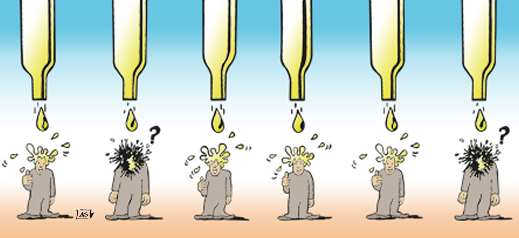

Thông thường R dùng rất phổ biến để phân tích và biểu diễn số liệu, tuy nhiên R có thể làm được rất nhiều thao tác xử lý ảnh và quan trong nhất là tính "reproductive" (lặp lại) đặc trưng khi dùng R. Thông qua các ví dụ về xử lý ảnh, R có thể thay thế hoàn hảo cho các phần mềm xử lý ảnh thông dùng ở một vài thao tác, tạo ảnh động và các thuật toán sâu hơn dựa trên database là dữ liệu ảnh.

# Giới thiệu chung và setup 

Cài đặt magick package Version 1.9 trên CRAN : `install.packages(magick)`

Thông tin về gói lệnh và cú pháp: `library(magick); ?magick`?

# Đọc và ghi ảnh  

## Link HTML  

## Other example 

<figure>

</figure>

## Đọc ảnh procedure
 

 
 
 
test 2

[Link tới 1 file html](https://rawgit.com/canhgiacduoc/canhgiacduoc.github.io/master/_posts/ggvis-ggplot.html)

.... to be continued!

[Link1](https://rawgit.com/canhgiacduoc/canhgiacduoc.github.io/master/_posts/Picture-In-R-Magick.nb.html)

[Link1](https://www.dropbox.com/s/t5xbmb8ib9q781h/Time-to-onset%20signal%20detection.nb.html?raw=1)

                        
Status (On projet Aug 2018) 

---
 

©Canhgiacduoc(2017)

